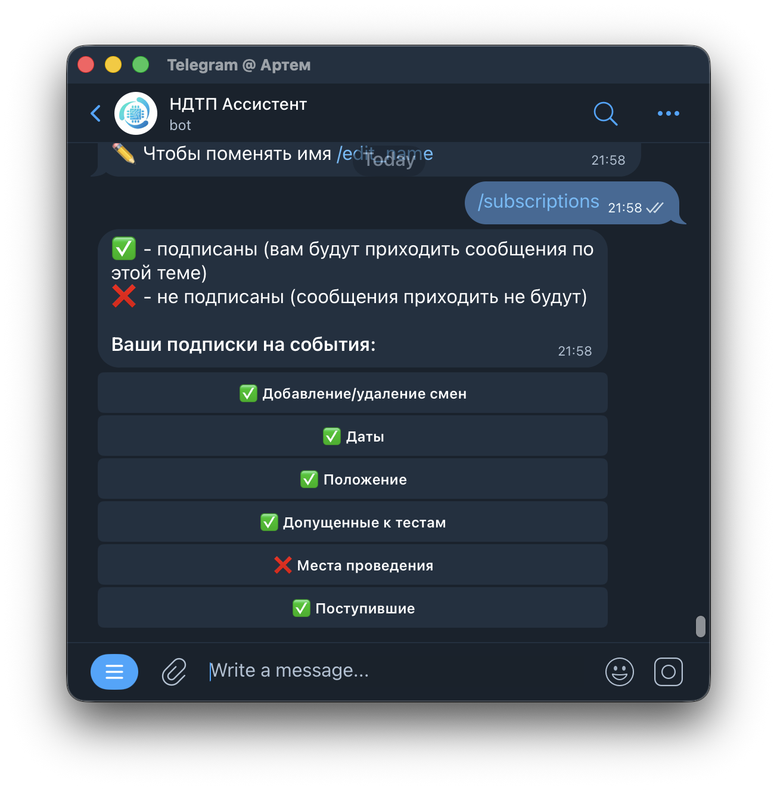
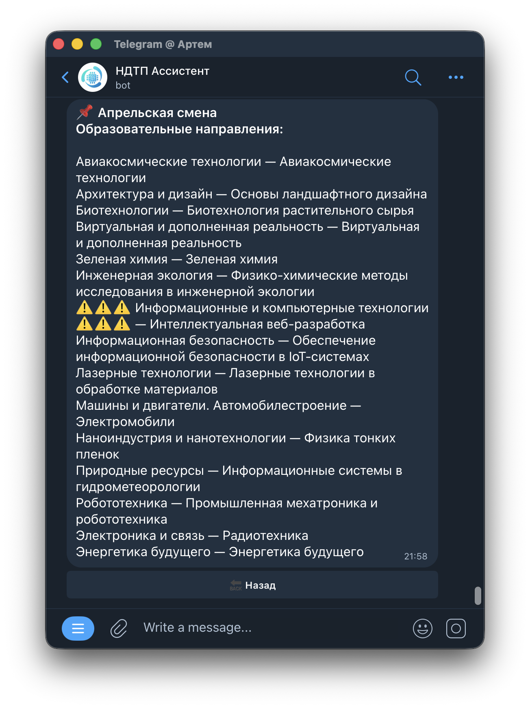
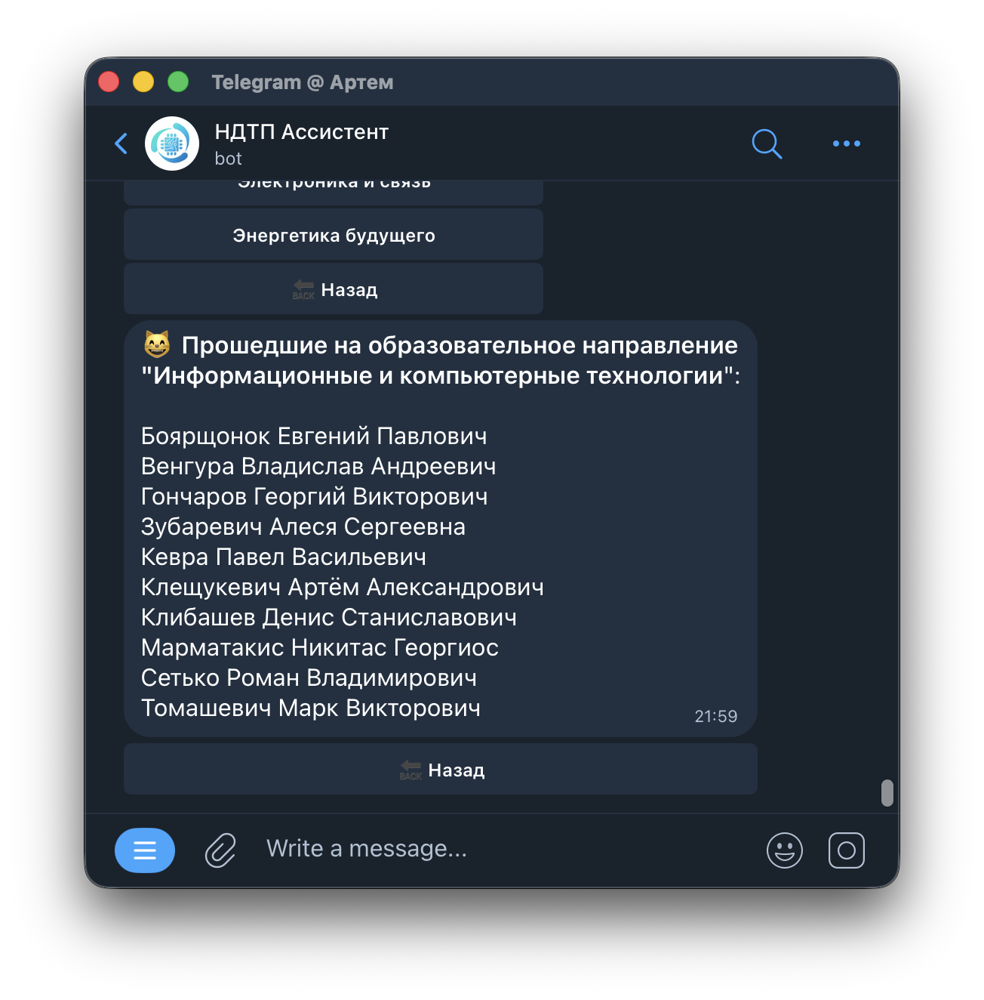
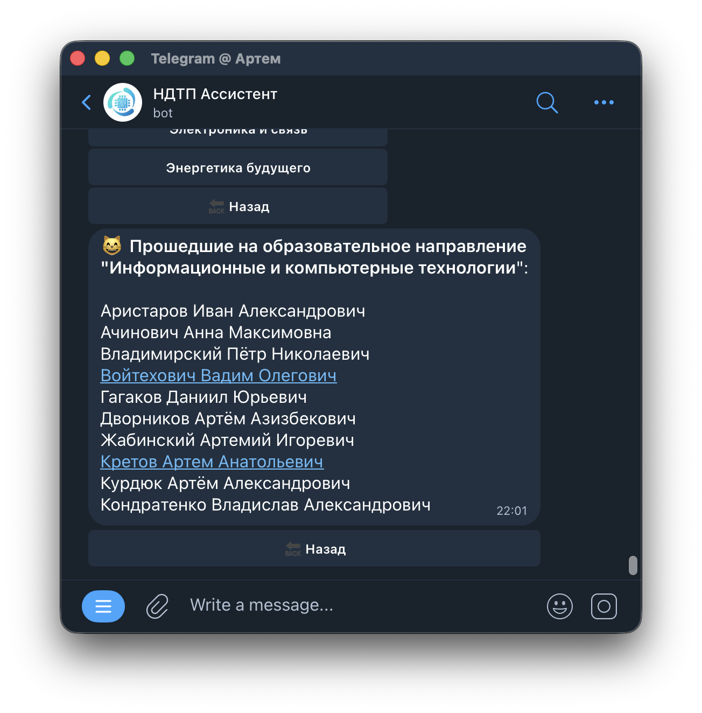
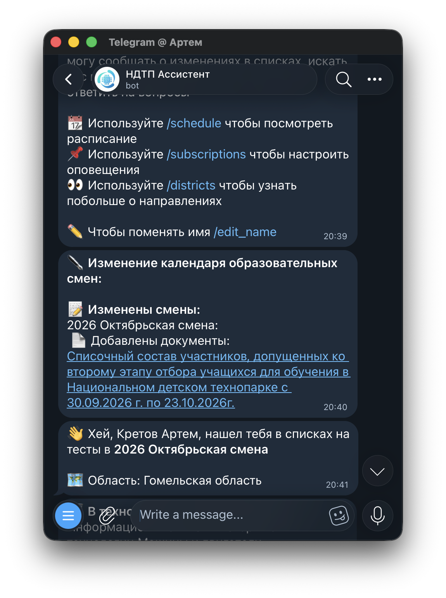
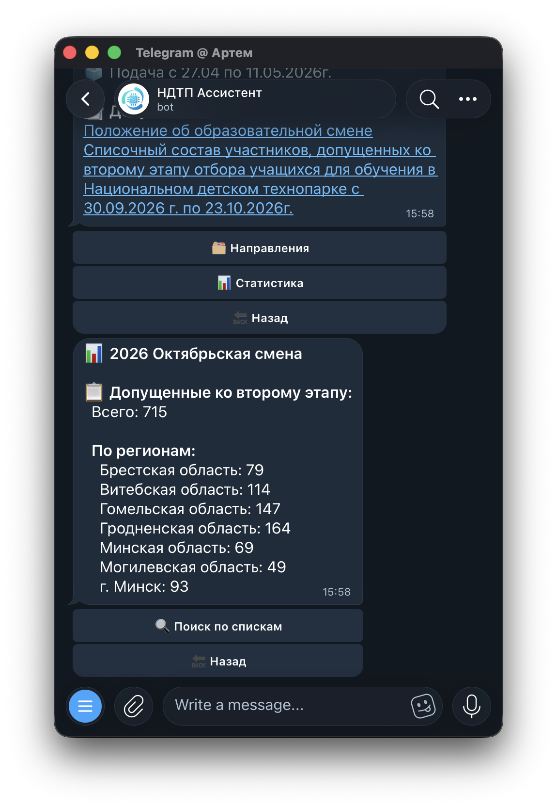
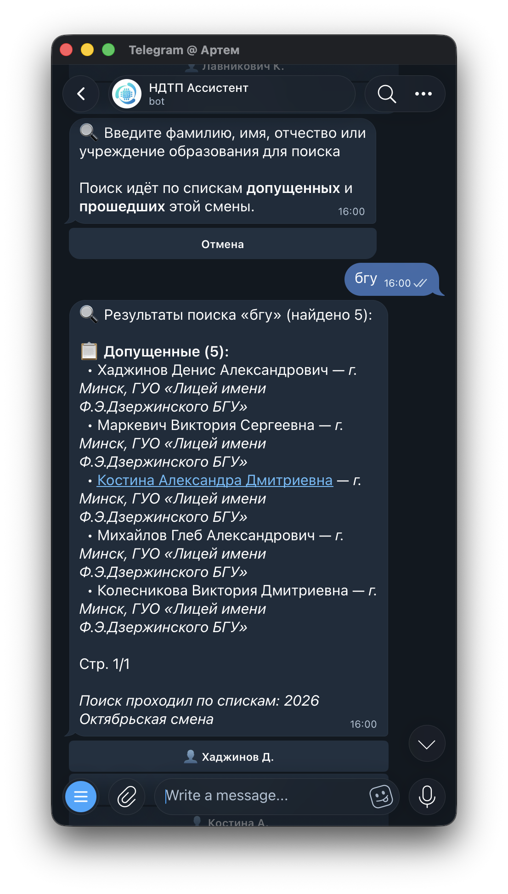
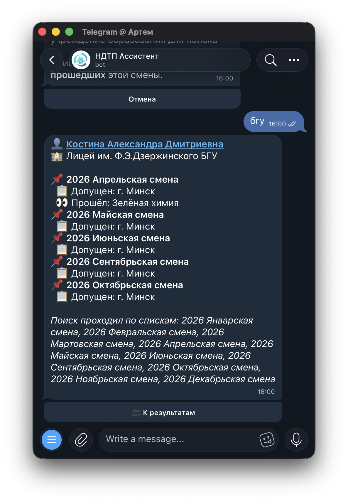
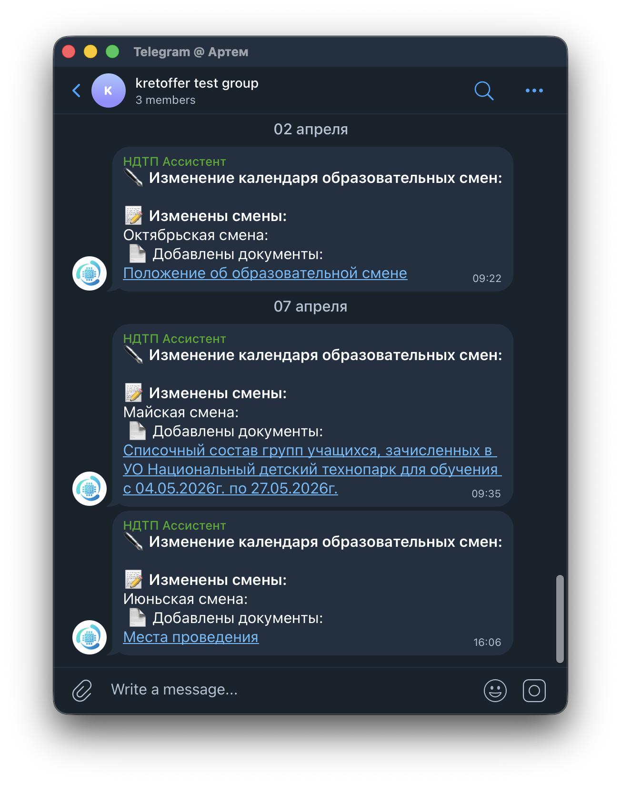

# Неофициальный Telegram-бот для НДТП

Неофициальный Telegram-бот, который помогает отслеживать изменения в расписании и списках на сайте Национального детского технопарка (НДТП).

**Ссылка на бота:** [@ndtp_assistant_bot](https://t.me/ndtp_assistant_bot)

## 🚀 Возможности

- **Отслеживание расписания:** Бот автоматически проверяет [страницу с расписанием](https://ndtp.by/schedule/) на предмет изменений:
  - 📅 Добавление и удаление смен
  - ✍️ Изменение дат проведения
  - 📄 Появление новых документов (положения, списки и т.д.)
- **Уведомления:** Пользователи могут подписаться на уведомления об интересующих их событиях и получать сообщения об изменениях. 
- **Просмотр информации о сменах:**
  - 📖 Просмотр образовательных направлений каждой смены. 
  - 🎓 Просмотр списков допущенных ко второму этапу и зачисленных учащихся. 
- **Персонализация:** Если вы укажете свои имя и фамилию, бот будет подсвечивать вас в списках и сообщать вам о том что нашел вас. 

- **Статистика и поиск:**
  - На странице смены доступна кнопка «📊 Статистика» — показывает общее количество допущенных с разбивкой по регионам. 
  - Кнопка «🔍 Поиск» позволяет искать человека по фамилии, имени, отчеству или учреждению образования в списках допущенных и прошедших выбранной смены. Если человек зарегестрирован в боте, то результат поиска с его именем будет кликабельным и вести на чат с ним. Результаты выводятся по 10 на страницу с пагинацией. 
  - Команда `/search` ищет по всем сменам сразу. У каждого найденного есть кнопка для просмотра профиля — все смены, куда человек допущен или прошёл. 
- **Работа в группах:** Бота можно добавить в групповой чат для получения уведомлений об изменениях в расписании. 

## 🛠️ Команды

- `/start` - Начало работы с ботом.
- `/schedule` - Просмотр актуального расписания смен.
- `/search` - Поиск человека по всем сменам (фамилия, имя, отчество, учреждение образования).
- `/subscriptions` - Настройка уведомлений.
- `/edit_name` - Добавление или изменение имени и фамилии для поиска в списках.

## ⚙️ Технологии

- **Язык:** Python
- **Telegram Bot API:** [aiogram](https://github.com/aiogram/aiogram)
- **Парсинг сайтов:** [aiohttp](https://github.com/aio-libs/aiohttp), [Beautiful Soup](https://www.crummy.com/software/BeautifulSoup/)
- **Парсинг PDF:** [pdfplumber](https://github.com/jsvine/pdfplumber)
- **База данных:** SQLite
- **Планировщик задач:** [APScheduler](https://github.com/agronholm/apscheduler)

## 📄 Лицензия

Этот проект распространяется под лицензией MIT. Подробности в файле [LICENSE](LICENSE).
